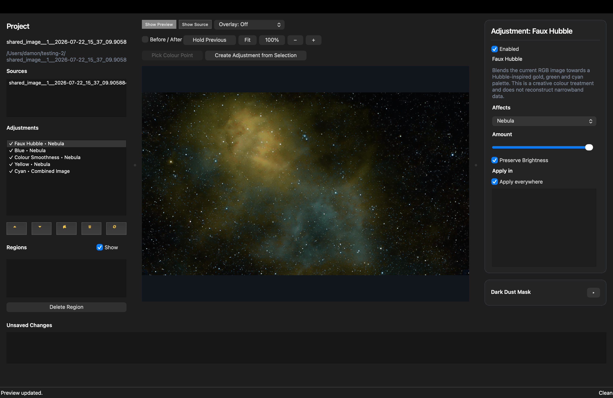
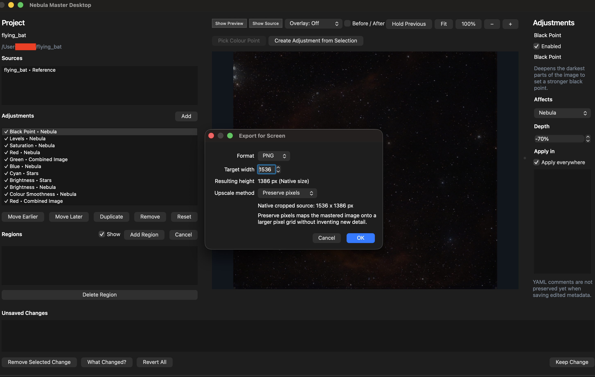
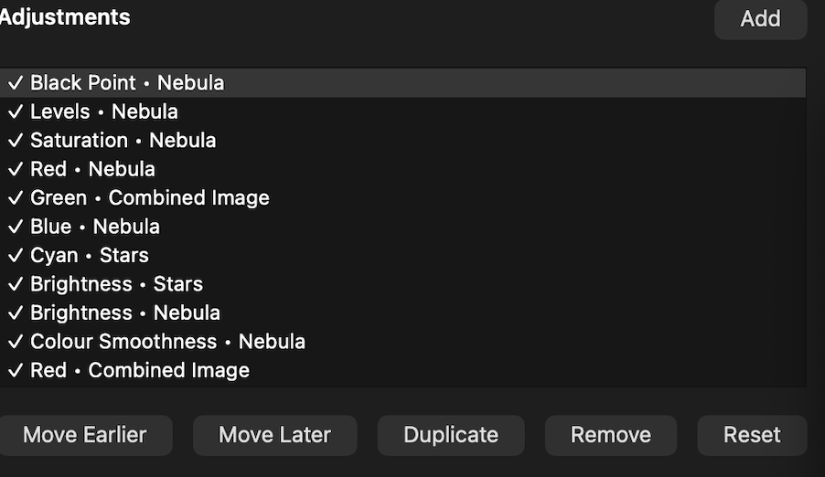

# Nebula Master

**Nebula Master starts where your smart telescope finishes.**

Turn images from Dwarf, Seestar, Vaonis and other smart telescopes into finished, shareable pictures without learning specialist astrophotography or photo-editing software.

Nebula Master starts with the already usable image produced by your telescope software or another application. It does not replace capture, calibration, stacking, plate solving or stretching. Those steps happen upstream. Nebula Master takes the prepared TIFF, PNG or JPEG image and helps you finish it.

Build your result from simple adjustments that can independently affect the nebula, stars, dark dust, the whole image or a selected area. Reorder, disable, duplicate or remove adjustments and Nebula Master rebuilds the image from the current settings. Apply creative palettes gradually, save and share processing recipes, then export at the right size for screen or print without inventing astronomical detail.

Your original image is never changed.



## Why Nebula Master?

### Start with the image you already have

Smart telescopes already produce a useful stacked and stretched image. Nebula Master begins from that point.

```text
Smart telescope
→ prepared image
→ Nebula Master
→ finished image
```

You open the image you already have and continue from there. No histograms, curves or specialist processing vocabulary are required just to get started.

### Keep every decision editable

Each change is an ordered adjustment in a visible processing flow.

You can:

- reorder adjustments
- disable an adjustment
- duplicate an adjustment
- remove an adjustment
- change its amount
- reopen the project later

Nothing is permanently baked into the source image. The current result always reflects the current adjustment order and enabled state.

Example flow:

```text
Reduce Stars
→ Reveal Nebula
→ Adjust Blue
→ Faux Hubble
→ Final Brightness
```

### Adjust the part that matters

Any adjustment can target:

- Nebula
- Stars
- Dark Dust
- Combined Image
- a selected region

That means you can:

- dim stars without weakening the nebula
- reveal dark dust without washing out the whole sky
- recolour the nebula while keeping stars more natural
- apply an effect only inside a selected area

### Apply creative palettes gradually

Faux palettes are ordinary adjustment layers, not all-or-nothing filters.

Available palettes include:

- Faux Hubble
- Faux HOO
- Foraxx-Inspired
- Gold & Cyan
- Natural Bi-colour

The `Amount` control behaves like a wet/dry mix:

- `0%` keeps the incoming image unchanged
- `100%` applies the full palette
- values in between blend between the two

These palettes are creative RGB treatments. They do not reconstruct genuine narrowband data from a standard colour image.

### Share processing recipes

Nebula Master projects already store an ordered adjustment flow that can be reused as a processing recipe for another image of the same target.

A shared recipe can include:

- adjustment types
- order
- targets
- palette choices
- slider values
- general mask settings

A shared recipe should not include:

- the original source image
- local machine paths
- private files

Example:

```text
Wizard Nebula — Dwarf Dual Band — Gold & Cyan
```

Another user can load that recipe structure, apply the same style of processing to their own image, and then fine-tune the sliders to suit their own data.

Share how the image was processed, not only the finished JPEG.

### Export for screen or print

The same project can be rendered for:

- social media
- desktop display
- television display
- high-resolution screen output
- print

You do not need separate manual edits for screen and print versions.

### Upscale without inventing detail

Nebula Master can increase output size while preserving the structure that is already present in the source image.

Make the image larger without inventing new astronomical detail.

More pixels, not imaginary detail.

Upscaling must not fabricate:

- stars
- nebula structure
- dust features
- astronomical detail absent from the source

## Try the beta

Nebula Master currently supports macOS and Windows.

If you use a smart telescope, try the beta with real images and let us know how it behaves on your system.

When reporting feedback, include:

- operating system
- source telescope or application
- source image type and dimensions
- what you attempted
- what you expected
- what happened
- screenshots or project details where useful

## A simple first workflow

1. Export a finished image from your smart telescope application.
2. Create a Nebula Master project from that image.
3. Add one or two broad adjustments.
4. Adjust Stars, Nebula, Dark Dust or the Combined Image independently.
5. Reorder or disable adjustments until the result looks right.
6. Optionally add a creative palette.
7. Compare with the source.
8. Save the project.
9. Export for screen or print.

## Supported inputs and devices

Nebula Master is designed for prepared images from:

- Dwarf
- Seestar
- Vaonis
- other smart telescopes
- any prepared TIFF, PNG or JPEG image

It is intended for image finishing after the telescope software or another application has already done the acquisition and preparation steps.

## Creative palettes

The current desktop app supports these palette adjustments:

- Faux Hubble
- Faux HOO
- Foraxx-Inspired
- Gold & Cyan
- Natural Bi-colour

Each one is an ordered adjustment that can be enabled, disabled, moved, duplicated, limited to a region, or aimed at a specific semantic target just like any other adjustment.

## Screen, print and upscaling

Final exports render through the shared engine rather than through a desktop-only path.

Screen export currently supports:

- PNG
- JPEG
- TIFF
- native-size or upscaled output
- `Preserve pixels` upscale mode for mapping the mastered image onto a larger pixel grid without inventing new detail

Print export currently supports:

- PNG
- JPEG
- TIFF
- physical dimensions
- DPI / PPI targeting
- shared-renderer output planning



## How projects work

Nebula Master keeps the imported source image unchanged.

The project stores editable adjustment instructions, regions, palette choices, render settings and related metadata. Previews and final renders are generated from those instructions, so the project can be reopened, changed later and rendered again.

```text
Immutable source image
+
Editable adjustment flow
↓
Renderer
↓
Screen or print output
```

Rendered TIFF, PNG and JPEG files are outputs, not the project itself.

## Installation and getting started

If you just want the current build without learning GitHub release mechanics, use these links:

- Latest release page: [github.com/bicalcarata/nebulamaster/releases/latest](https://github.com/bicalcarata/nebulamaster/releases/latest)
- All versions: [github.com/bicalcarata/nebulamaster/releases](https://github.com/bicalcarata/nebulamaster/releases)
- Latest macOS installer: [NebulaMaster.dmg](https://github.com/bicalcarata/nebulamaster/releases/latest/download/NebulaMaster.dmg)
- Latest Windows installer: [NebulaMaster-Setup.exe](https://github.com/bicalcarata/nebulamaster/releases/latest/download/NebulaMaster-Setup.exe)

For a simple walkthrough, see [docs/nebula-master-get-started.pdf](/Users/damon/gitlab/nebulamaster/docs/nebula-master-get-started.pdf).

## Beta testing and feedback

Please test with real images from your telescope workflow.

Useful feedback includes:

- where the workflow felt clear
- where the wording felt confusing
- which adjustments gave the result you wanted
- where the preview or export did not match expectations
- project files or screenshots that help reproduce a problem

## Advanced technical details

The current repository includes:

- a typed YAML project model built with Pydantic v2
- shared image loading, validation, preview rendering and export paths
- a renderer CLI with `nebula validate`, `nebula preview`, `nebula diff`, `nebula git` and `nebula render`
- a PySide6 desktop authoring client that edits declarative project metadata

Current desktop mastering controls include:

- colour adjustments for Blue, Red, Green, Cyan and Yellow
- tonal adjustments for Brightness, Saturation, Black Point, Shadows and five-band Levels
- colour smoothing
- semantic targets for Combined Image, Nebula, Stars and Dark Dust
- polygon region scoping
- image-driven colour-point sampling and adjustment creation
- a resizable three-panel desktop workspace with the preview toolbar anchored to the centre panel
- compact icon helper buttons for moving, duplicating, removing, and resetting adjustments
- a collapsible Dark Dust control section in the right-hand inspector
- built-in desktop help with a first-run getting-started popup and a reusable Help action
- screen and print export using the shared renderer
- packaged desktop application paths for macOS and Windows with a Nebula Master app icon

The desktop preview can also show star, nebula and dark dust overlays so the user can see the current semantic split before applying adjustments.

The renderer is also exposed through a CLI:

```text
nebula validate
nebula preview
nebula render
nebula diff
nebula explain
```

Plugins may contribute semantic masks, colour palettes, transformations, render profiles and project migrations. They contribute declarative behaviour and must never mutate source images.

See [docs/architecture.md](/Users/damon/gitlab/nebulamaster/docs/architecture.md) and [docs/project-format.md](/Users/damon/gitlab/nebulamaster/docs/project-format.md) for the deeper implementation details.

## Desktop overview

The current desktop app is a working authoring environment for real projects. Adjustments are ordered, target-aware and non-destructive.


The adjustment stack is declaration-ordered and shows what each adjustment affects:

- `Black Point` for deeper dark tones
- `Levels` for five tonal bands from darkest to brightest
- Colour adjustments targeted at `Nebula`, `Stars`, or `Combined Image`
- Multiple brightness and colour adjustments in a deterministic stack



Current desktop workflows include:

- Create a new project from a TIFF, PNG, or JPEG source image
- Open and edit declarative projects
- Target adjustments at `Nebula`, `Stars`, `Dark Dust`, or `Combined Image`
- Pick colour points directly from the image
- Create adjustments from image selections
- Draw polygon regions and scope adjustments to them
- Preview semantic star, nebula, and dark dust overlays
- Resize the left, center, and right panels to match the current task
- Collapse or reopen Dark Dust controls without leaving the adjustment inspector
- Use icon-button tooltips on narrow sidebars instead of losing action access
- Open built-in help from the desktop and suppress the first-run help popup after reading it
- Keep semantic unsaved-change history

## Current Adjustment Types

The desktop currently supports these editable adjustment types:

- Black Point
- Levels
- Shadows
- Brightness
- Saturation
- Blue
- Red
- Green
- Cyan
- Yellow
- Colour Smoothness
- Faux Hubble
- Faux HOO
- Foraxx-Inspired
- Gold & Cyan
- Natural Bi-colour

Levels is implemented as a five-band tonal adjustment with explicit controls for:

- Darkest
- Dark
- Mid
- Light
- Brightest

The faux palette adjustments operate on prepared RGB images rather than reconstructed
narrowband channels. `Amount` is a wet/dry blend from the incoming image state to the
full palette result, `Nebula` is the recommended default target, and the same adjustments
can also be constrained with regions or directed at `Dark Dust` while leaving `Stars`
more natural.

## Export

Final exports render through the shared engine rather than through a desktop-only path.

Screen export currently supports:

- PNG
- JPEG
- TIFF
- Native-size or upscaled output
- `Preserve pixels` upscale mode for mapping the mastered image onto a larger pixel grid without inventing new detail

Print export currently supports:

- PNG
- JPEG
- TIFF
- Physical dimensions
- DPI / PPI targeting
- Shared-renderer output planning


## Desktop help and workflow guidance

The desktop app now includes built-in help aimed at first-time users:

- a `Help` action in the app
- a first-run getting-started popup
- a `Do not display this window again` option for users who have already seen the guide

That help content explains the real first-use flow:

- create a project from an image
- choose where the project folder should live
- add and tune adjustments
- save the project metadata
- export a render
- reopen the saved project later through `project.yaml`

The same guidance is also available as [docs/nebula-master-get-started.pdf](/Users/damon/gitlab/nebulamaster/docs/nebula-master-get-started.pdf).

## Development and local packaging

The desktop application now has explicit packaging paths for both macOS and Windows.

Prerequisites:

- Python 3.13
- Synced workspace dependencies with `uv`
- macOS for `.app` and `.dmg` production
- Windows for native Windows desktop builds

Build steps:

```bash
uv sync --dev
make package-desktop
```

Or call the packaging entrypoint directly:

```bash
uv run python scripts/package_desktop.py
```

On Windows PowerShell:

```powershell
uv sync --dev
uv run python scripts/package_desktop.py
```

Artifacts are written to `dist/`.

On macOS:

- `dist/Nebula Master.app`
- `dist/NebulaMaster.app.zip`
- `dist/NebulaMaster.dmg`

On Windows:

- `dist/Nebula Master/`
- `dist/NebulaMaster-windows.zip`
- `dist/NebulaMaster-Setup.exe` when Inno Setup is available

The packaging entrypoint is [scripts/package_desktop.py](/Users/damon/gitlab/nebulamaster/scripts/package_desktop.py), which:

- builds the app via PyInstaller using [apps/desktop/packaging/nebula_master.spec](/Users/damon/gitlab/nebulamaster/apps/desktop/packaging/nebula_master.spec)
- generates the bundled Nebula Master application icon from [scripts/build_app_icon.py](/Users/damon/gitlab/nebulamaster/scripts/build_app_icon.py)
- emits `.icns` for macOS and `.ico` for Windows
- packages native desktop artifacts for the current platform
- emits a portable Windows `.zip` plus an installer `.exe` when Inno Setup is installed

## Development release automation

The repository includes three GitHub Actions workflows:

- [.github/workflows/ci.yml](/Users/damon/gitlab/nebulamaster/.github/workflows/ci.yml) runs the main lint, typecheck, and test suite on Ubuntu and a Windows desktop import smoke test on `windows-latest`.
- [.github/workflows/create-release.yml](/Users/damon/gitlab/nebulamaster/.github/workflows/create-release.yml) is a manual release-tag workflow. It validates the requested version, confirms it matches [pyproject.toml](/Users/damon/gitlab/nebulamaster/pyproject.toml), and pushes the version tag to GitHub.
- [.github/workflows/package-desktop.yml](/Users/damon/gitlab/nebulamaster/.github/workflows/package-desktop.yml) builds standalone desktop artifacts on macOS and Windows on demand and on immutable semver release tags.

Release flow:

1. Bump the repo version with `make bump-version VERSION=0.4.0` and push the commit to GitHub.
2. In GitHub, open `Actions` -> `Create Release` -> `Run workflow`.
3. Enter a version tag such as `v0.4.0` and choose the target ref, usually `main`.
4. The workflow confirms the tag matches the repo version, then creates and pushes the annotated tag.
5. The same workflow then starts `Package Desktop` explicitly for that tag, which avoids GitHub's suppressed follow-on workflow behavior for `GITHUB_TOKEN` tag pushes.
6. `Package Desktop` creates a draft release, uploads the macOS and Windows assets to that draft, and only then publishes the immutable release.
7. After publish, `Package Desktop` updates the movable major tag, for example `v0`, to the released commit.

This gives Nebula Master both immutable versioned releases such as `v0.4.0` and a movable convenience tag such as `v0`.

For non-release test builds, run the `Package Desktop` workflow manually with `workflow_dispatch` and download the artifacts from the workflow run.
