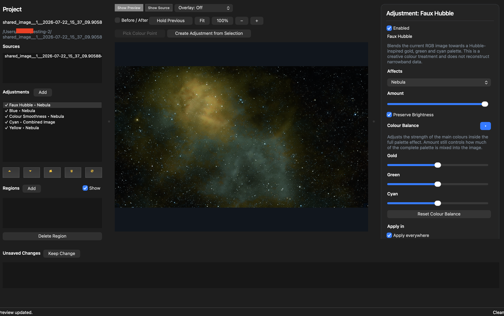
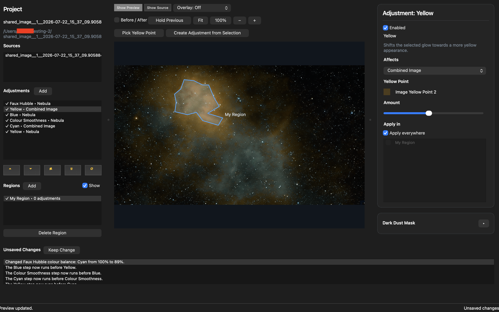
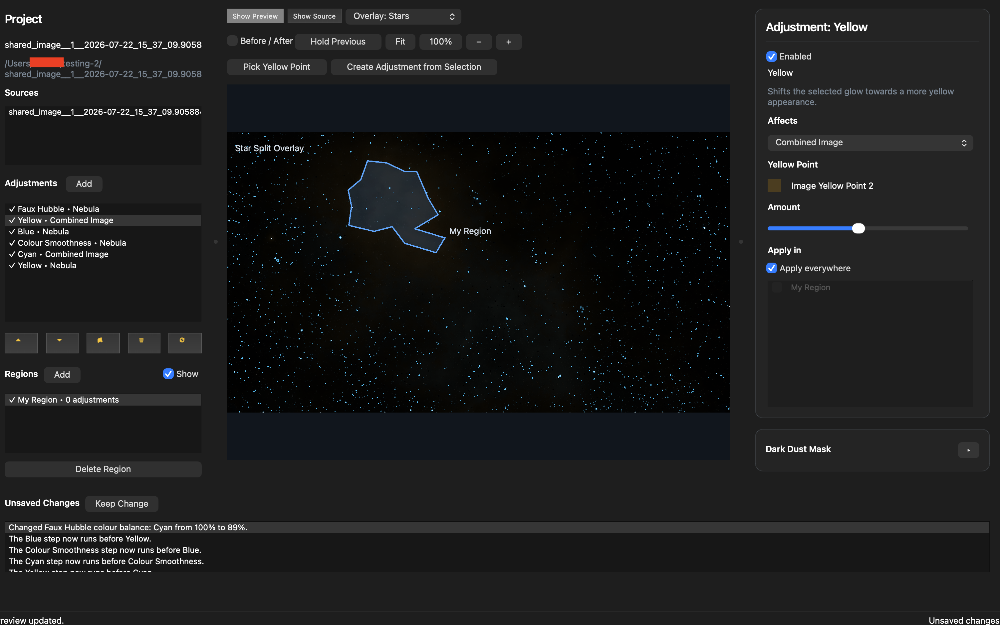
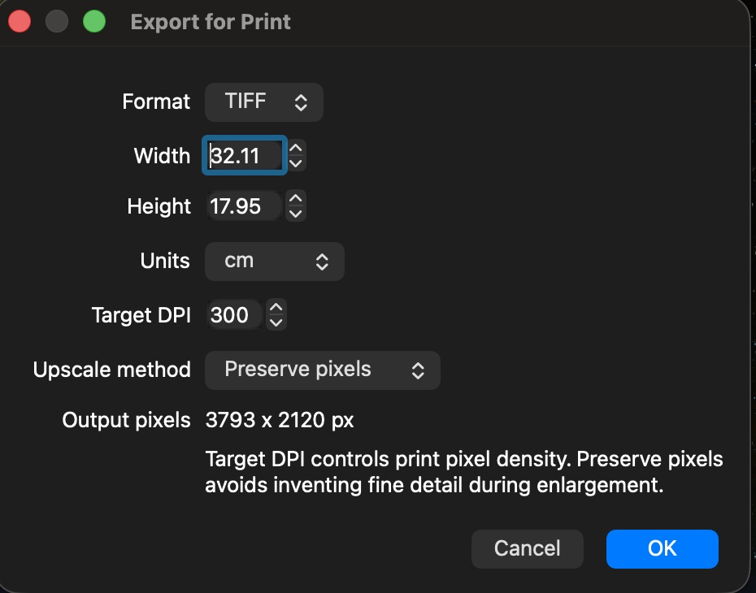
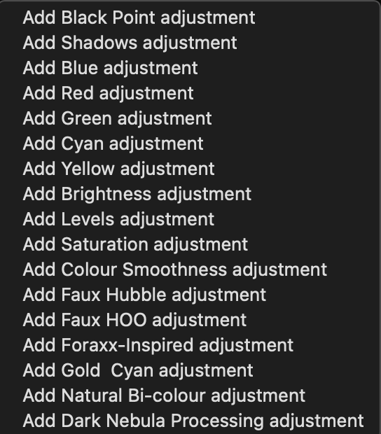

# Nebula Master

**Nebula Master starts where your smart telescope finishes.**

Nebula Master is a desktop image-mastering application for already-prepared deep-sky images.
It is designed for beginners who want better final results from smart-telescope images without
learning a conventional astrophotography processing stack or a general-purpose photo editor.

You start with the image your telescope software already produced. Nebula Master helps you refine
the nebula, stars, dark dust and colour balance with ordered, non-destructive adjustments. Your
source image is never modified.



## Download

- Latest release page: [github.com/bicalcarata/nebulamaster/releases/latest](https://github.com/bicalcarata/nebulamaster/releases/latest)
- All versions: [github.com/bicalcarata/nebulamaster/releases](https://github.com/bicalcarata/nebulamaster/releases)
- Latest macOS installer: [NebulaMaster-MacOS.dmg](https://github.com/bicalcarata/nebulamaster/releases/latest/download/NebulaMaster-MacOS.dmg)
- Latest Windows installer: [NebulaMaster-Windows-Setup.exe](https://github.com/bicalcarata/nebulamaster/releases/latest/download/NebulaMaster-Windows-Setup.exe)

## What’s New In 0.5.1

- `Dark Nebula Processing` is now a first-class ordered adjustment that targets `Dark Dust`.
- Faux palette adjustments now expose per-colour balance controls so palettes can be tuned instead of only mixed wet/dry.
- Preview rendering for heavy dark-dust work now runs against preview-sized working images, which keeps interactive edits far more responsive on large telescope images.
- Regions remain part of the normal declarative adjustment flow and can be drawn, named, reused and applied to existing adjustments.
- Star overlays, nebula overlays and dark-dust overlays continue to use the same semantic masks that drive the actual renderer.
- Print export is now documented more clearly as a shared-renderer workflow with physical dimensions, DPI and preserve-pixels upscaling.
- Recently opened projects now persist across sessions through the `File` menu instead of only during the current launch.
- Opening another project, creating a new project, or closing the app now prompts to save, discard, or cancel if there are unsaved semantic changes.
- Preview state is now clearer while working, with explicit `Queued`, `Rendering`, `Ready`, `Cancelled`, and `Failed` feedback instead of a mostly static footer.
- Empty projects now guide the user directly towards `File/Open Project` or `File/New Project from Image`.

## Why Nebula Master?

### Start with the image you already have

Nebula Master is for the image that already came out of:

- Dwarf
- Seestar
- Vaonis
- another smart telescope
- any other workflow that already produced a usable TIFF, PNG or JPEG

It does not replace capture, stacking, plate solving, calibration or stretching. Those happen
upstream. Nebula Master begins with the prepared image and helps you finish it.

```text
Smart telescope or upstream workflow
→ prepared image
→ Nebula Master project
→ finished screen or print render
```

### Keep every decision editable

Each change is an ordered adjustment in a visible processing stack.

You can:

- add an adjustment
- change its target
- limit it to a region
- reorder it
- disable it
- duplicate it
- remove it
- reopen the project later and keep refining it

Nothing is destructively baked into the original source image.

### Adjust what matters

Every normal adjustment can target:

- `Combined Image`
- `Nebula`
- `Stars`
- `Dark Dust`

Adjustments can also be limited to one or more polygon regions.

That means you can do things like:

- darken stars without crushing the nebula
- strengthen dark-nebula structure without changing the entire image
- push a colour treatment into one visible cloud
- soften or brighten only the selected area of a target

## The 0.5.1 Desktop Workflow

### Ordered adjustments and palette tuning

The main desktop view keeps the project, adjustment stack, preview, semantic toolbar and
inspector visible at the same time.

Faux palette adjustments behave like any other adjustment in the ordered chain. In 0.5.1 they
also expose palette-specific colour-balance controls in the inspector.


### Region-based local adjustments

Regions are drawn directly over the image preview and remain part of the same declarative project.
Once a region exists, any existing adjustment can be scoped to it through the normal inspector.



### Semantic overlays for renderer-visible masks

The preview overlay selector is not just visual decoration. It shows the semantic mask family the
renderer is already using.

Use overlays to inspect what Nebula Master currently thinks is:

- `Stars`
- `Nebula`
- `Dark Dust`

This makes it easier to decide where an adjustment should be aimed before changing it.



### Print export through the shared renderer

Screen and print export are both rendered through the same engine used for previewing. Print export
supports physical dimensions, units, target DPI and preserve-pixels upscaling.

`Preserve pixels` enlarges the output grid without inventing fine astronomical detail.



### Expanded adjustment library

The desktop adjustment menu now makes the available mastering tools clearer up front.



### Smoother day-to-day editing

The desktop app now does more of the small things users expect from a real editor:

- recent projects remain available across restarts
- unsaved project changes are confirmed before destructive navigation
- the preview area reports whether rendering is queued, active, ready, cancelled, or failed
- the unsaved-changes area reflects whether the project is currently clean or dirty
- a blank workspace tells the user exactly how to start

## Current Adjustment Types

### Tonal and colour adjustments

- Black Point
- Shadows
- Brightness
- Levels
- Saturation
- Blue
- Red
- Green
- Cyan
- Yellow
- Colour Smoothness

### Faux palettes

- Faux Hubble
- Faux HOO
- Foraxx-Inspired
- Gold & Cyan
- Natural Bi-colour

These are creative RGB palette treatments, not reconstructed narrowband data.

Each faux palette supports:

- ordered placement in the adjustment stack
- normal target selection
- region scoping
- enable, disable, duplicate, move, reset and remove
- a wet/dry `Amount`
- per-palette colour-balance controls

### Dark-dust-specific adjustment

- Dark Nebula Processing

`Dark Nebula Processing` is an ordered adjustment, not a hidden global mode. It can be moved,
duplicated, disabled, scoped to regions, and blended with the rest of the stack like any other
adjustment.

It is designed to reveal faint translucent dark-nebula structure while preserving the depth of the
denser obscuring regions already present in the image.

## A Simple First Workflow

1. Export a prepared TIFF, PNG or JPEG from your telescope software.
2. Open that image in Nebula Master.
3. Choose where the new project folder should be created.
4. Add one or two broad adjustments.
5. Aim each adjustment at `Nebula`, `Stars`, `Dark Dust`, or `Combined Image`.
6. Optionally draw a region and apply a selected adjustment inside it.
7. Compare the preview with the source.
8. Save the project metadata with `Keep Change`.
9. Export for screen or print.
10. Reopen the project later through `project.yaml` and continue editing.

## Projects, Recipes And Reproducibility

Nebula Master keeps the imported source image unchanged.

The project stores:

- source image references
- ordered adjustments
- semantic targets
- colour-point selections
- regions
- palette choices
- dark-dust settings
- render settings

Previews and exports are generated outputs, not the project itself.

```text
Immutable source image
+
Editable project metadata
↓
Shared renderer
↓
Preview, screen output, print output
```

Because the processing flow is declarative, a project can also serve as a reusable recipe for a
similar target and style.

## Desktop Help

The desktop app includes built-in help for first-time users:

- a `Help` action in the app
- a first-run help popup
- a `Do not display this window again` option
- an `About Nebula Master` dialog with version and support links
- clearer startup guidance when no project is open
- recent project reopening through the `File` menu across app sessions

There is also a PDF quick-start guide here:

- [docs/nebula-master-get-started.pdf](docs/nebula-master-get-started.pdf)

## Supported Inputs

Nebula Master currently works with prepared:

- TIFF
- PNG
- JPEG

It is intended for already-usable images, not raw capture pipelines.

## Desktop Capabilities At A Glance

The current desktop release supports:

- creating a new project from a source image
- opening existing declarative projects
- ordered adjustment stacks
- semantic targets for `Combined Image`, `Nebula`, `Stars`, and `Dark Dust`
- polygon regions with direct preview editing
- semantic overlays in the preview
- image-driven point sampling
- `Create Adjustment from Selection`
- palette-specific colour-balance controls
- Dark Nebula Processing
- screen export
- print export
- macOS and Windows packaged desktop builds

## Renderer And CLI

The shared renderer is available both through the desktop app and the CLI.

Available CLI commands include:

```text
nebula validate
nebula preview
nebula render
nebula diff
nebula explain
```

The desktop application does not have its own private rendering path. Preview, export and CLI
rendering all go through the same engine.

## Architecture

The repository currently includes:

- typed project models built with Pydantic v2
- shared image loading and image writing
- shared semantic-mask analysis
- shared preview and export rendering
- a renderer CLI
- a PySide6 desktop authoring application
- packaging for macOS and Windows

For deeper implementation details, see:

- [docs/architecture.md](docs/architecture.md)
- [docs/project-format.md](docs/project-format.md)

## Development And Local Packaging

Prerequisites:

- Python 3.13
- `uv`
- synced workspace dependencies

Typical local setup:

```bash
uv sync --dev
make package-desktop
```

Or run the packaging entrypoint directly:

```bash
uv run python scripts/package_desktop.py
```

On Windows PowerShell:

```powershell
uv sync --dev
uv run python scripts/package_desktop.py
```

Artifacts are written to `dist/`.

Current release asset names are:

- `NebulaMaster-MacOS.dmg`
- `NebulaMaster-MacOS.app.zip`
- `NebulaMaster-Windows-Setup.exe`
- `NebulaMaster-Windows.zip`

## Release Workflow

The repository includes GitHub Actions for:

- CI
- manual release-tag creation
- macOS desktop packaging
- Windows desktop packaging

For a normal versioned release:

1. Bump the repo version, for example to `0.5.1`.
2. Push the commit to GitHub.
3. Run `Create Release` from the GitHub Actions tab with a tag such as `v0.5.1`.
4. Let `Package Desktop` build the macOS and Windows artifacts for that tag.
5. Publish the immutable release once the artifacts are attached.

## Beta Testing

Nebula Master is now at the point where it is a usable image processor rather than only an
experiment. Real telescope images are the best way to find the next problems and the next good
ideas.

Useful feedback includes:

- operating system
- source telescope or upstream application
- source image format and dimensions
- what you tried
- what you expected
- what actually happened
- screenshots or project files where useful
